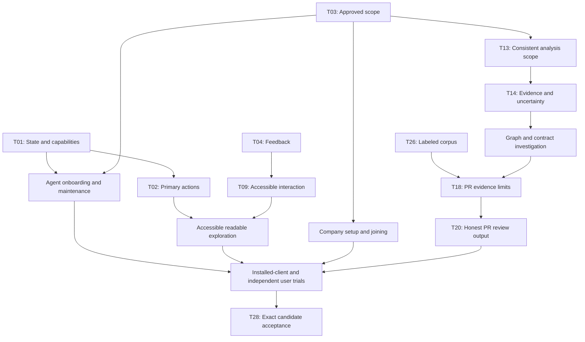

# DiffMind coordinated improvement plan

Prepared 2 October 2026 from the [journey audit](journey-audit.md), [live usability study](live-usability-study.md) and retained tests/runtime evidence. Source baseline: `5d2548514bfc5d920dfd40def5fcacd80162e9ae`.

Status: proposed solutions and created [Linear project](https://linear.app/mnim/project/diffmind-simpler-ux-and-dependable-background-context-2125822ad508). The [Start here guide](https://linear.app/mnim/document/start-here-coordinated-solutions-and-finding-coverage-d5cf0e7dbd13) links the first tasks and full coverage. Product implementation has not started in this task. The earlier reports remain historical evidence; this document adds a solution plan at the user's subsequent request.

## Intended experience

A developer connects DiffMind, approves the repository and file scope once, and lets their agent operate the existing workflow. The background runtime maintains approved context while it is available. The developer normally works in their usual agent; the dashboard offers readable evidence when they want to explore.

A company developer enters a prepared project and receives an explicit browser/agent handoff. A viewer reads existing context; an editor can request refresh; an administrator owns source configuration and access. A person exploring architecture can understand scope, readiness, relationships, supporting evidence and compatibility changes without first learning the ingestion pipeline.

The improvement is coordinated across these paths. Automatic updates are only useful if source scope is correct, state is truthful, resource limits hold and the answering snapshot is visible. A clean toolbar cannot solve misleading architecture. A precise contract comparison cannot repair an unproven PR-head snapshot. Access simplicity must retain the existing authorization boundary.

## Shared design decisions

| Concern | Proposed resolution | Safeguard |
| --- | --- | --- |
| User intent and actions | One primary Update context outcome with appropriate local/queued execution; advanced operations remain available to eligible operators. | Screen reload stays separate from source work; viewers never gain management authority. |
| Readiness | Shared UI/MCP meaning for runtime, saved graph, job phase, source freshness, known limits and next action. | Completed analysis does not mean complete architecture or exact PR eligibility. |
| Scope | Named candidate preview, retained draft, local/managed source semantics and existing file include/exclude policy. | Scope changes require renewed review; later automation does not discover or clone new repositories. |
| Maintenance | Configure the existing incremental scheduler during authorized onboarding; propose a 15-minute active-runtime cadence with overdue reconnect catch-up and explicit manual/pause control. | Cadence is a proposed default to validate. Queries stay read-only; background work uses existing queues/caps and never pulls local worktrees. |
| Local availability | Keep one owner per home, explain other-client connection and use the existing secured shared route for continuous operation. | No hidden OS service, lock bypass, unauthenticated endpoint forwarding or multi-replica promise. |
| Feedback and interaction | Shared visible validation/recovery messages and accessible modal/form primitives. | No blind mutation retry, hidden permission bypass or feedback stranded behind overlays. |
| Exploration | Readable initial focus, discoverable overview/search, keyboard-equivalent selection and explicit bounded evidence continuation. | Large synthetic rendered topology is not treated as real extraction/load evidence. |
| Architecture trust | Apply approved source policy across extraction, contracts, packs and metrics; expose provenance and unknowns. | Example directory names are not a universal exclusion rule; static/declarative evidence remains distinct from runtime truth. |
| Change investigation | Surface existing contract comparison alongside graph-fact comparison; explain why source, scope, analyzer or pack changes can affect a diff. | Pinned snapshots stay immutable; a difference does not automatically establish its cause. |
| PR investigation | Lead with evidence and missing context, align existing provider settings, preserve revision checks and classify unsupported deletions/transitive cases honestly. | A low heuristic score or absent exact caller is not merge safety. |
| Company access | Explicit scoped new-company setup, reviewed legacy migration, role-aware joining and independent token/offboarding handling. | No silent migration, repository-ACL mirroring, SSO provisioning or inferred token ownership. |
| Recovery | Existing backup/maintenance workflow with post-restore access reconciliation before reopening a shared instance. | Older backups may restore revoked credentials; retain single-server and path/schema limits. |
| Evidence | Real-source labeled corpus, fresh installed-host tasks, independent people and exact-candidate gates. | No invented participant results, accuracy rates, performance targets or release completion. |

The shared modal behavior follows [W3C APG modal-dialog guidance](https://www.w3.org/WAI/ARIA/apg/patterns/dialog-modal/). MCP task guidance retains explicit descriptions and authority boundaries rather than assuming tool discovery alone determines host behavior; the protocol's tools interface is documented in the [MCP specification](https://modelcontextprotocol.io/specification/2025-11-25/server/tools). Those sources were checked on 2 October 2026. Proposed product choices above are our synthesis, not vendor requirements.

## Scope and existing foundation

This is an enhancement of installed bootstrap, MCP management/query, ingestion, scheduled incremental refresh, graph/evidence inspection, contracts, on-demand PR impact, project access, gap/pack correction and offline recovery. It does not recreate mechanisms already marked delivered in [ROADMAP](../../ROADMAP.md) or the September [readiness checkpoint](../../RELEASE-READINESS-PLAN.md). The October live findings identify remaining cross-surface behavior and validation work.

Native Windows binaries, universal framework/contract support, runtime traffic collection, general monorepo ownership, distributed/HA hosting, automatic SSO/ACL mirroring and automatic code-host PR posting are separate scope decisions. Current functionality should describe these boundaries honestly and offer existing supported routes. They are not hidden dependencies of this improvement project.

A connection host can still require explicit registration/reconnect. The local session still cannot index after its process exits. An agent may prepare authorized temporary checkouts through its normal tools, but this batch does not introduce a new automatic PR-head checkout service.

## Epics and coordinated delivery

### E1 — One understandable workspace model

Replace inconsistent concepts of ready, fresh, permitted and in progress with shared meaning across the dashboard, agents and background work.

Outcome: People and agents can identify the scope, saved snapshot, current work, limitations and next permitted action without learning internal pipeline stages.

Tasks: T01, T02, T03, T04.

### E2 — Install once and maintain approved context

Make the existing individual-agent route dependable from installation through reconnect and background updates, within the current runtime and authorization boundaries.

Outcome: After scope approval the agent maintains context while DiffMind is running, reuses unchanged analysis and explains availability/freshness when the session ends or changes.

Tasks: T05, T06, T07, T08.

### E3 — Simple accessible onboarding and exploration

Treat import, first use, graph navigation and recovery as one accessible task flow instead of unrelated screens and modal patches.

Outcome: A newcomer can inspect scope, reach a readable graph and inspect all relevant evidence using mouse or keyboard with visible feedback.

Tasks: T09, T10, T11, T12.

### E4 — Architecture evidence users can trust

Prevent scope leakage and ambiguous evidence from turning a completed scan into a misleading architecture conclusion; preserve deterministic, inspectable analysis.

Outcome: Examples and alternate scenarios are identifiable, declared/extracted evidence stays distinguishable, changes retain provenance, and correction uses reviewed existing mechanisms.

Tasks: T13, T14, T15, T16.

### E5 — Clear evidence-based change and PR investigation

Bring existing contract comparison and PR impact into a coherent investigation path without presenting heuristics or stale context as merge safety.

Outcome: Reviewers and agents understand compatibility changes, revision eligibility, provider availability, exact callers, candidates and unsupported cases from the same evidence.

Tasks: T17, T18, T19, T20.

### E6 — Safe company entry access and continuity

Make the existing shared workspace understandable for joining developers and maintainable for administrators without weakening project-level access.

Outcome: The joining browser and agent paths are explicit; ordinary users see appropriate actions; revocation, upgrade and restore have verified access outcomes.

Tasks: T21, T22, T23, T24.

### E7 — Prove the complete experience

Keep historical docs, mechanistic tests and successful fixtures from substituting for independently measured user/agent outcomes and real-source interpretation.

Outcome: An exact candidate is backed by reproducible corpus checks, installed-client observations, independent persona trials and truthful documentation.

Tasks: T25, T26, T27, T28.

### Milestone gates

- **M1: 1 — Shared foundations and evidence.** Agree the state, capability, action, error and authorized-scope contracts shared by UI, MCP and background work. Establish independently labeled graph/PR baselines before judging accuracy. Exit: contracts reviewed and baseline corpus reproducible; no claim of implementation completion.
- **M2: 2 — Integrated user and agent journeys.** Deliver the existing three journeys using the same contracts: understandable onboarding and import, bounded automatic refresh, readable accessible exploration, trustworthy evidence, useful PR investigation and safe company access. Exit: integrated walkthroughs demonstrate the proposed behavior and preserve existing persistence/authorization safeguards.
- **M3: 3 — Verified candidate.** Align entry documentation with the implemented experience, conduct installed-client and independent-human trials, and verify the exact candidate with the existing native/release gates plus cross-journey regressions. Exit: no critical task blocker, evidence limitations recorded, no misleading accuracy/availability claims. Publication is a separate maintainer action.

M1 has four independent starting tasks: **T01 state/capabilities, T03 scope, T04 feedback, and T26 labeled evidence**. T02 action simplification follows the state contract. Once those foundations settle, installation/agent, accessible UI, source trust, provider handling and company setup can move concurrently where their actual prerequisites permit. M3 is a candidate gate, not a calendar commitment.

Dependencies are between tasks, not an artificial serial order for every epic. Related tasks can share design/review work, but a shared contract must be agreed before downstream behavior is treated as complete. Do not mark an epic done merely because its UI patch landed: its outcome includes the linked workflow and validation.

## Task index

Stable T/E keys are local planning keys; the verified Linear identifiers and URLs are recorded in [linear-backlog.md](linear-backlog.md). Parent issues model epics; child issues hold executable work. Priorities are qualitative, with no unsupported estimates, assignments or dates.

| Key | Epic | Work item | Milestone | Initial state | Blocking prerequisites |
| --- | --- | --- | --- | --- | --- |
| T01 | E1 | Define shared readiness freshness and capability states | M1 | Todo | Ready to start |
| T02 | E1 | Use one primary refresh action with role-aware advanced operations | M1 | Backlog | T01 |
| T03 | E1 | Define one approved scope contract for discovery and automation | M1 | Todo | Ready to start |
| T04 | E1 | Standardize actionable feedback and recovery across UI and agents | M1 | Todo | Ready to start |
| T05 | E2 | Make installed startup and worker execution independent of PATH accidents | M2 | Backlog | T01 |
| T06 | E2 | Guide agent onboarding project selection and evidence use | M2 | Backlog | T01, T03, T05 |
| T07 | E2 | Enable bounded background refresh after approved onboarding | M2 | Backlog | T01, T03, T06 |
| T08 | E2 | Clarify local lifecycle and handle shared clients without competing owners | M2 | Backlog | T01, T05, T07 |
| T09 | E3 | Repair shared modal form and confirmation accessibility | M2 | Backlog | T04 |
| T10 | E3 | Turn import preview into a retained review-and-build flow | M2 | Backlog | T03, T09, T13 |
| T11 | E3 | Make graph selection readable keyboard-accessible and fully inspectable | M2 | Backlog | T02, T09 |
| T12 | E3 | Distinguish empty loading denied failed and partial workspace states | M2 | Backlog | T01, T02, T04, T09 |
| T13 | E4 | Apply approved file scope consistently to facts contracts and metrics | M2 | Backlog | T03 |
| T14 | E4 | Explain evidence origin uncertainty and coverage consistently | M2 | Backlog | T01, T13 |
| T15 | E4 | Use the existing gap and pack workflow for reviewed corrections | M2 | Backlog | T03, T14 |
| T16 | E4 | Explain snapshot differences through input provenance and evidence | M2 | Backlog | T14 |
| T17 | E5 | Expose existing contract compatibility alongside graph changes | M2 | Backlog | T12, T14, T16 |
| T18 | E5 | Make PR revision eligibility and deletion limitations actionable | M2 | Backlog | T14, T16, T26 |
| T19 | E5 | Align existing repository provider settings with PR retrieval states | M2 | Backlog | T03 |
| T20 | E5 | Present PR evidence before heuristic scores and clarify delivery | M2 | Backlog | T14, T17, T18, T19 |
| T21 | E6 | Make shared access scope explicit and safely adopt scoped defaults | M2 | Backlog | T01, T03 |
| T22 | E6 | Make joining browser and agent setup a clear role-aware handoff | M2 | Backlog | T05, T06, T21 |
| T23 | E6 | Make access loss and offboarding understandable across independent grants | M2 | Backlog | T04, T21, T22 |
| T24 | E6 | Verify upgrade backup and restore with access-policy reconciliation | M2 | Backlog | T08, T21, T23 |
| T25 | E7 | Align installation operation and evaluation docs with the implemented journey | M3 | Backlog | T05, T06, T20, T21 |
| T26 | E7 | Establish an independently labeled real-source graph and PR corpus | M1 | Todo | Ready to start |
| T27 | E7 | Observe independent developers and actual installed-agent use | M3 | Backlog | T06, T10, T11, T12, T17, T20, T22, T23 |
| T28 | E7 | Verify the exact candidate across all three journeys and safeguards | M3 | Backlog | T07, T08, T11, T15, T20, T24, T25, T26, T27 |

Detailed solutions, acceptance criteria and validation are in [work-items.md](work-items.md), with a machine-readable copy in [improvement-plan.json](improvement-plan.json). Initial Todo means ready to start, not already underway. Dependent work stays in Backlog. Read the state of the overall experience from the milestones and dependencies.

## Complete finding-to-solution coverage

All **42 audit findings and 11 live findings** map to one or more tasks. A covered boundary can be resolved through truthful workflow/documentation or measurement; mapping does not imply implementation is complete or that every observation was a proven defect.

| Finding | Original concern | Solution/validation task(s) | Evidence report |
| --- | --- | --- | --- |
| F01 | Agent setup has obsolete release advice | T25 | [journey-audit.md](journey-audit.md) |
| F02 | Background maintenance is conditional in local mode | T07 | [journey-audit.md](journey-audit.md) |
| F03 | One product exposes distinct agent contracts | T06 | [journey-audit.md](journey-audit.md) |
| F04 | Tool discovery does not establish adoption | T06, T27 | [journey-audit.md](journey-audit.md) |
| F05 | Bootstrap success remains a host boundary | T05, T27 | [journey-audit.md](journey-audit.md) |
| F06 | Platform availability is narrower than generic agent availability | T05 | [journey-audit.md](journey-audit.md) |
| F07 | Multiple agents share a lifecycle constraint | T08 | [journey-audit.md](journey-audit.md) |
| F08 | Project selection requires a domain translation | T03, T06 | [journey-audit.md](journey-audit.md) |
| F09 | Import scope has different defaults by surface | T03, T10, T13 | [journey-audit.md](journey-audit.md) |
| F10 | Local and managed sources have different freshness meanings | T03, T07, T14 | [journey-audit.md](journey-audit.md) |
| F11 | Accepted work is not usable context | T01, T04, T12 | [journey-audit.md](journey-audit.md) |
| F12 | Latest completed graph is a snapshot fallback | T01, T07, T08 | [journey-audit.md](journey-audit.md) |
| F13 | Process completion does not establish semantic completeness | T01, T13, T14 | [journey-audit.md](journey-audit.md) |
| F14 | Public compatibility scans expose limited detection coverage | T15, T26 | [journey-audit.md](journey-audit.md) |
| F15 | Synthetic scale is separate from real extraction scale | T11, T26 | [journey-audit.md](journey-audit.md) |
| F16 | Declared and extracted relationships have different meanings | T14 | [journey-audit.md](journey-audit.md) |
| F17 | Teaching is an ongoing governance activity | T15 | [journey-audit.md](journey-audit.md) |
| F18 | Static source is not runtime truth | T14 | [journey-audit.md](journey-audit.md) |
| F19 | Whole-view graph labels can become visually small | T11 | [journey-audit.md](journey-audit.md) |
| F20 | Workspace operations vocabulary is crowded | T02, T12 | [journey-audit.md](journey-audit.md) |
| F21 | First project creation limits exploratory control | T12 | [journey-audit.md](journey-audit.md) |
| F22 | Project-list failure also produces an empty list | T12 | [journey-audit.md](journey-audit.md) |
| F23 | Shared dialogs lack several expected interaction behaviors | T09 | [journey-audit.md](journey-audit.md) |
| F24 | Graph keyboard interaction is uneven | T11 | [journey-audit.md](journey-audit.md) |
| F25 | Detail views bound how much evidence is visible | T06, T11 | [journey-audit.md](journey-audit.md) |
| F26 | PR impact is not an automatic code-host review lifecycle | T20 | [journey-audit.md](journey-audit.md) |
| F27 | Exact PR evidence requires matching clean revision | T18 | [journey-audit.md](journey-audit.md) |
| F28 | PR scores are heuristics with no demonstrated calibration | T20, T26 | [journey-audit.md](journey-audit.md) |
| F29 | Removed and indirectly changed behavior remain a PR evidence limit | T18, T26 | [journey-audit.md](journey-audit.md) |
| F30 | Import and PR provider scope may diverge | T19 | [journey-audit.md](journey-audit.md) |
| F31 | Browser identity does not automatically connect the agent | T22 | [journey-audit.md](journey-audit.md) |
| F32 | Project access does not mirror code-host repository permissions | T21 | [journey-audit.md](journey-audit.md) |
| F33 | Scoped company access must be deliberately enabled | T21 | [journey-audit.md](journey-audit.md) |
| F34 | Correction authority is centralized in scoped mode | T15, T22 | [journey-audit.md](journey-audit.md) |
| F35 | Offboarding spans independent grants | T23 | [journey-audit.md](journey-audit.md) |
| F36 | Recovery restores authority as well as architecture | T24 | [journey-audit.md](journey-audit.md) |
| F37 | Persistence is a single-server operating contract | T08, T24 | [journey-audit.md](journey-audit.md) |
| F38 | Operational measures are not user-outcome measures | T27, T28 | [journey-audit.md](journey-audit.md) |
| F39 | Graph differences can have multiple causes | T16, T17 | [journey-audit.md](journey-audit.md) |
| F40 | Old evaluation instructions remain discoverable | T25 | [journey-audit.md](journey-audit.md) |
| F41 | Existing tests prove important mechanisms within bounded fixtures | T26, T28 | [journey-audit.md](journey-audit.md) |
| F42 | Actual behavior of target personas remains unmeasured | T27 | [journey-audit.md](journey-audit.md) |
| L01 | Preview results not displayed | T10 | [live-usability-study.md](live-usability-study.md) |
| L02 | Import draft and preview state lost | T10 | [live-usability-study.md](live-usability-study.md) |
| L03 | Validation error obscured by modal | T04, T09, T10 | [live-usability-study.md](live-usability-study.md) |
| L04 | First-use modal focus and labels | T09 | [live-usability-study.md](live-usability-study.md) |
| L05 | Absolute executable launch versus PATH worker lookup | T05 | [live-usability-study.md](live-usability-study.md) |
| L06 | Default refresh and session-owned availability | T07, T08 | [live-usability-study.md](live-usability-study.md) |
| L07 | Initial graph label readability | T11 | [live-usability-study.md](live-usability-study.md) |
| L08 | Graph-fact versus contract-field comparison | T16, T17 | [live-usability-study.md](live-usability-study.md) |
| L09 | Local repository PR empty-state ambiguity | T12, T19 | [live-usability-study.md](live-usability-study.md) |
| L10 | Generic page after correct access removal | T12, T23 | [live-usability-study.md](live-usability-study.md) |
| L11 | Example/scenario facts attributed to enclosing service | T13, T14, T26 | [live-usability-study.md](live-usability-study.md) |

## Acceptance of the complete experience

The final candidate should demonstrate all three paths end to end, including re-entry and failure states:

- Individual: supported installation and actual host connection → explicit approved scope → first useful evidence → bounded maintained context → persisted reconnect and safe source-change refresh.
- Joining developer: prepared project grant → browser/agent handoff → evidence use with correct authority → refresh support → comprehensible access loss and separately reviewed token revocation.
- Explorer: non-trapping first use → visible scope preview and errors → readable keyboard-accessible graph → complete relevant evidence → distinct graph/contract comparison → honest PR limitations.

Preserve the strengths observed live: the six-service/nine-relationship fixture graph, one-changed/five-reused refresh, all-six unchanged reuse, four expected contract-field changes, viewer denial, token revocation, queued completion and explicit stale PR status. The example-source attribution case must remain a regression in the assembled graph/contract corpus.

Proposed readability and cadence thresholds are design hypotheses until verified. Semantic accuracy targets are agreed on independently labeled supported cases before scoring the candidate. Human evidence requires real participants; the observer baseline is not a substitute.

At this planning checkpoint, the user authorized solutions and Linear creation. This task does not implement product changes, recruit participants, deploy a service, publish a release or post to PRs. Those are future work items with concrete validation/authorization boundaries.
